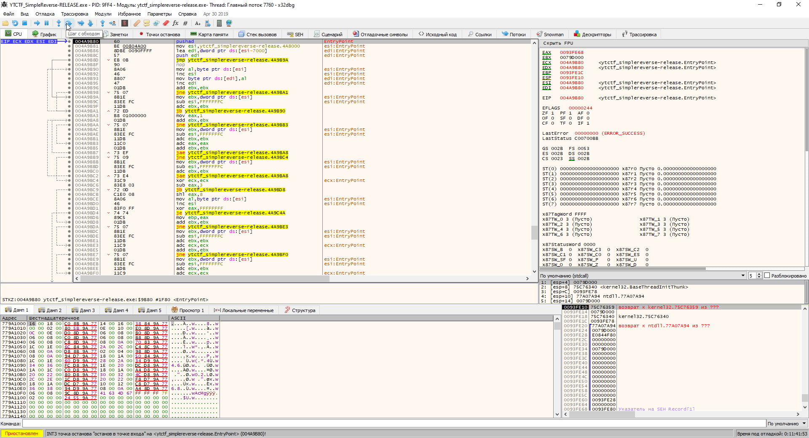
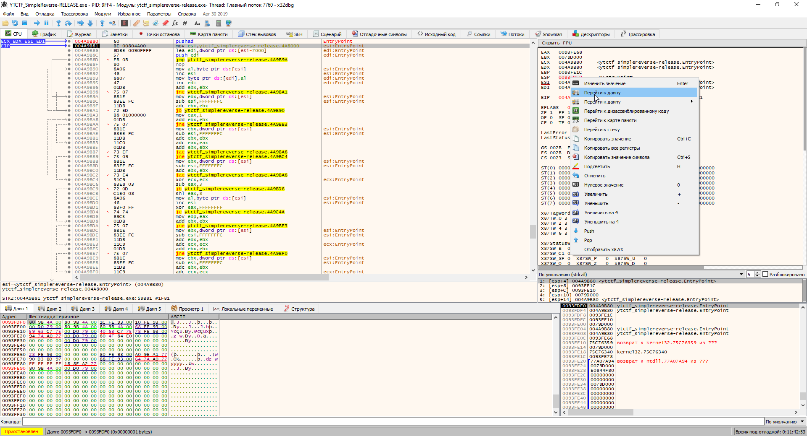
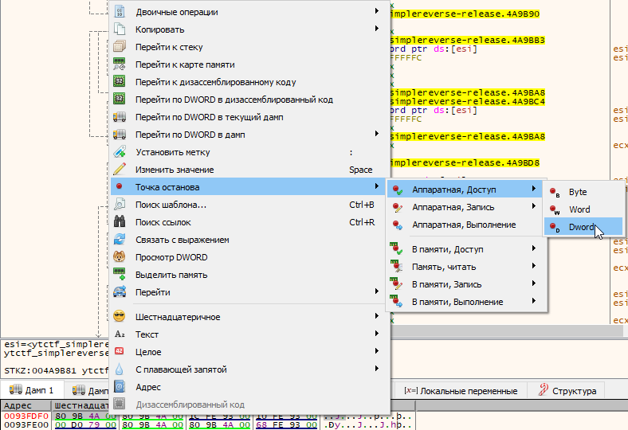
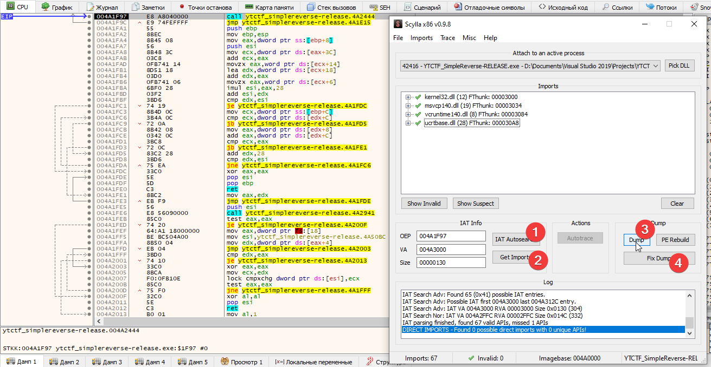

# STK Crypto Storage by MrSteyk: Write-Up

## Не всё так просто, как казалось...

Изначально Вы должны были запустить файл, потыкаться и понять, что есть фейк флаги (#классика).

Нам дан PE файл. Открываем в [DiE (Detect it Easy)](http://ntinfo.biz/index.html). Если детектор 
нормальный, то скажет, что у нас [UPX](https://upx.github.io/) или что-то подобное. Попытаемся
распаковать...
```
                       Ultimate Packer for eXecutables
                          Copyright (C) 1996 - 2018
UPX 3.95w       Markus Oberhumer, Laszlo Molnar & John Reiser   Aug 26th 2018

        File size         Ratio      Format      Name
   --------------------   ------   -----------   -----------
upx: .\stk_cs.exe: CantUnpackException: file is modified/hacked/protected; take care!!!

Unpacked 0 files.
```

### Произошло ПонимаюⓂ©™

Идём в гугл и находим замечательную [статью про изичный анпак UPX](https://goggleheadedhacker.com/blog/post/6)
или читаем мою версию далее.

## Распаковка

Идём в любой отладчик (я взял [x64dbg](https://x64dbg.com/)) и ставим BP (Break Point) на EntryPoint
(точка входа) (по дефолту в x64dbg он должен стоять, изначально вы будете во внутренностях запуска,
нажмите один раз "продолжить" и вы окажетесь в EntryPoint).



Делаем Single Step (Single Instruction)



Смотрим в дампе по ESP



Делаем BP по доступу как DWORD (32 bit)



Пара SI (Single Step/Single Instruction) и мы в OEP (Original Entry Point, изначальная точка входа
до "запаковки"). Запускаем
[Scylla (по дефолту есть в x64dbg, нужно просто тыкнуть на иконку с буквой `S`)](https://github.com/NtQuery/Scylla)
или подобное (гуглим `import reconstructor`) и дампим с фиксом импортов. Возможно, надо будет
удалить один импорт с красным крестом, просто нажмите клавишу `Del`.

**Дисклеймер: Данный дамп может не запускаться, но он нам нужен для статик анализа (анализ бинарника
без его запуска, т.е. противоположное тому, что мы делали).**

## Статик (Статический) анализ

Открываем дамп в [IDA](https://www.hex-rays.com/products/ida/) или подобном софте. Нажимаем
`Shift+F12`, чтобы сгенерить список строк. Идём на строки, которые Вас приветствовали, и тыкаем
`X` (Икс) чтобы найти X-Ref'ы (Cross-Reference, позволяет искать, где используется строка) для
данной строки. Идём по первому и попадаем в настоящий мейн. Отсюда вы можете нажать F5, если у вас
куплен Hex-Rays Decompiler, чтобы увидеть псевдо C (Си) код.

Отсюда Вы должны были узнать что есть псевдо X-Ref дестроер (частый трюк для анти статик анализа)
(`XOR 0x80908090`) и базовая ксор крипта (ну это быстро и не надо думать) (`XOR 0x80`).

Вот на моменте с X-Ref дестроером я остановлюсь. Если мы нажмём `X` для просмотра xref'ов любого
`dword_########`, то мы увидим что он юзается несколько раз. Нам нужен тот у которого рядом стоит
буква w (write). Мы смотрим на функцию и видим, что в ней используются какие-то байтики. Именно их
и использует программа. Поздравляю Вас, боец, вы преодолели простой xref destroyer!

На самом деле всё можно было решить и без анпака (простой отладкой, т.к. никакого антидебага нет),
но я просто хотел показать, что UPX-подобные пакеры легко дампятся. Расшифровываем все строки
(тупо делаем XOR с 0x80 на странные строки (про них чуть выше)) и видим, что нас попросят ввести
пароль в тело флага. Делаем это и сдаём `ytctf{UpX_iS_A_n1c3_p4kr_WiTh_Nou_Flaws_AT_and_T_all}`.
ПРОФИТ!

З.Ы. сам флаг является отсылкой на частое использование UPX-подобного в качестве спасительных тасков
на реверс и пакеры/crackme. Ну и куда без AT&T — создателей лучшего (нет) синтаксиса языка ассемблера!
