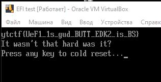

# STK ll b1nary by MrSteyk: Write-up

Нам дан файл `llwattisit`. Прогоняем его через утилиту `file` и получаем `MS-DOS executable`, но при
более детальном анализе можно понять, что этот бинарь - `UEFI_APPLICATION`.

Пытаемся его запустить...

Если вы делаете это с VirtualBox на винде, то рекомендую скопировать файл на флешку в `FAT32` и
затем выполнить данную команду (где `#` - номер физического устройства, смотрится через `diskmgmt.msc`):

```bat
VBoxManage internalcommands createrawvmdk -filename usb.vmdk -rawdisk \\.\PhysicalDrive#
```

Для линукса схожая операция ( `/dev/sdc` - файл устройства)

```bash
VBoxManage internalcommands createrawvmdk -filename usb.vmdk -rawdisk /dev/sdc
```

Затем запускаете VirtualBox от админа и жмёте эскейп при запуске виртуалки с данным диском
(ФЛЭШКА ДОЛЖНА БЫТЬ ВОТКНУТА НА ПРОТЯЖЕНИИ ВСЕЙ ПРОЦЕДУРЫ ЗАПУСКА). Грузитесь из файла
(Boot Maintaince -> Boot From File -> SomeLongDeviceName -> llwattisit)

Видим приятную глазу картину:


